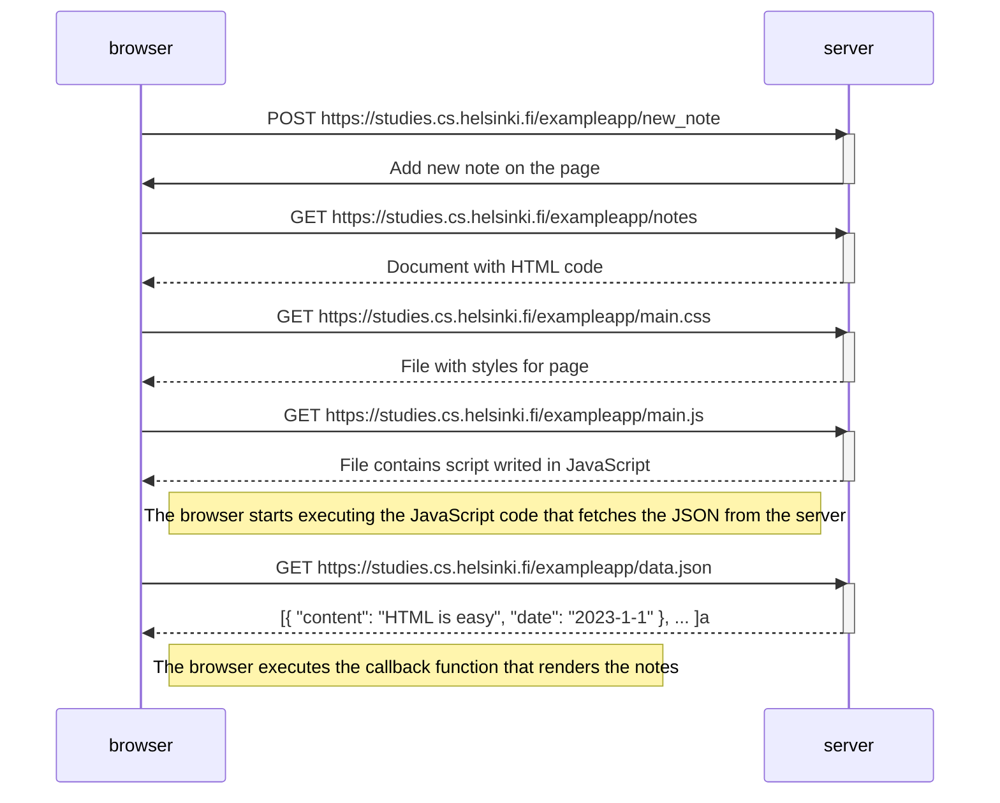

```mermaid
sequenceDiagram
    participant browser
    participant server

    browser->>server:POST https://studies.cs.helsinki.fi/exampleapp/new_note
    activate server
    server->>browser: Add new note on the page
    deactivate server


    browser->>server: GET https://studies.cs.helsinki.fi/exampleapp/notes
    activate server
    server-->>browser: Document with HTML code
    deactivate server

    browser->>server: GET https://studies.cs.helsinki.fi/exampleapp/main.css
    activate server
    server-->>browser: File with styles for page
    deactivate server

    browser->>server: GET https://studies.cs.helsinki.fi/exampleapp/main.js
    activate server
    server-->>browser: File contains script writed in JavaScript
    deactivate server

    Note right of browser: The browser starts executing the JavaScript code that fetches the JSON from the server

    browser->>server: GET https://studies.cs.helsinki.fi/exampleapp/data.json
    activate server
    server-->>browser: [{ "content": "HTML is easy", "date": "2023-1-1" }, ... ]a
    deactivate server

    Note right of browser: The browser executes the callback function that renders the notes
```